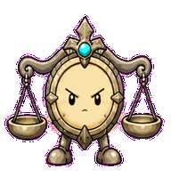

# Tradeoff Scale

A tradeoff companion that makes product choices feel like balancing real weight
instead of listing pros and cons.


## Animation Catalog

| Idle | Running Right | Running Left |
| --- | --- | --- |
|  |  |  |

| Waving | Jumping | Failed |
| --- | --- | --- |
|  |  |  |

| Waiting | Running | Review |
| --- | --- | --- |
|  |  |  |

The full Codex install asset is [`spritesheet.webp`](spritesheet.webp). GIF previews are rendered from the committed spritesheet for GitHub review.

## Install

```bash
mkdir -p ~/.codex/pets
cp -R pets/tradeoff-scale ~/.codex/pets/
```

Then refresh custom pets in Codex and select `Tradeoff Scale`.

## Motion Notes

- `idle`: lets the pans breathe in opposite directions.
- `running-right` / `running-left`: moves with the leading pan carrying weight.
- `waving`: lifts one pan like a tiny courtroom greeting.
- `jumping`: performs a careful low hop while the pans swing through level.
- `failed`: sinks both pans at once and bends the beam without falling apart.
- `waiting`: holds two uneven options until the tradeoff is accepted.
- `running`: shifts counterweight pan-to-pan until the beam becomes level.
- `review`: settles into a level beam with one crisp pivot beat.

## Source

- Origin: original pet generated for Familiars.
- Author: Jorge Alcantara / Zentrik.
- License: MIT for this pet bundle in this repository.

## Preview

Full contact sheet: [preview/contact-sheet.png](preview/contact-sheet.png)
