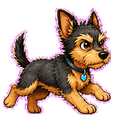
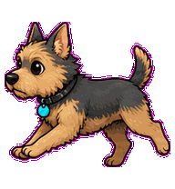

# Type Terrier

A compiler-error terrier that digs at type mismatches until the overload is clear.


## Animation Catalog

| Idle | Running Right | Running Left |
| --- | --- | --- |
|  |  |  |

| Waving | Jumping | Failed |
| --- | --- | --- |
|  |  |  |

| Waiting | Running | Review |
| --- | --- | --- |
|  |  |  |

The full Codex install asset is [`spritesheet.webp`](spritesheet.webp). GIF previews are rendered from the committed spritesheet for GitHub review.

## Install

```bash
mkdir -p ~/.codex/pets
cp -R pets/type-terrier ~/.codex/pets/
```

Then refresh custom pets in Codex and select `Type Terrier`.

## Motion Notes

- `idle`: stays alert with small ear and tail micro-motions.
- `running-right` / `running-left`: trots with ears snapping toward invisible type errors.
- `waving`: greets through a paw lift and ear snap, with no wave marks.
- `jumping`: makes a short eager hop when it spots the mismatch.
- `failed`: droops the ears asymmetrically and freezes the tail.
- `waiting`: sits sharply while waiting for the overload choice.
- `running`: digs at an invisible type mismatch, then perks when it resolves.
- `review`: points its nose at one invisible type edge while holding a paw in place.

## Source

- Origin: original pet generated for Familiars.
- Author: Jorge Alcantara / Zentrik.
- License: MIT for this pet bundle in this repository.

## Preview

Full contact sheet: [preview/contact-sheet.png](preview/contact-sheet.png)
