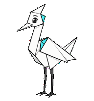
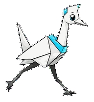
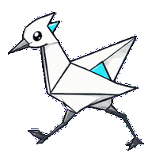
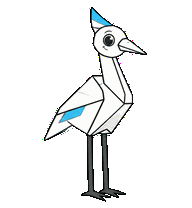
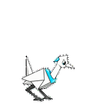
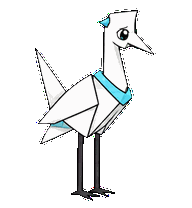
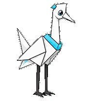
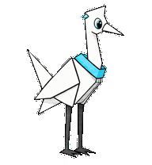
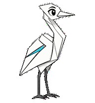

# Zentri

A Zentrik-inspired folded-paper crane mascot with crisp charcoal crease lines
and a bright cyan brand accent.



## Animation Catalog

| Idle | Running Right | Running Left |
| --- | --- | --- |
|  |  |  |

| Waving | Jumping | Failed |
| --- | --- | --- |
|  |  |  |

| Waiting | Running | Review |
| --- | --- | --- |
|  |  |  |

The full Codex install asset is [`spritesheet.webp`](spritesheet.webp). GIF previews are rendered from the committed spritesheet for GitHub review.

## Install

```bash
mkdir -p ~/.codex/pets
cp -R pets/zentri ~/.codex/pets/
```

Then refresh custom pets in Codex and select `Zentri`.

## Source

- Origin: original pet generated from the Zentrik logo reference.
- Author: Jorge Alcantara / Zentrik.
- License: MIT for this pet bundle in this repository.

## Preview

Full contact sheet: [preview/contact-sheet.png](preview/contact-sheet.png)

